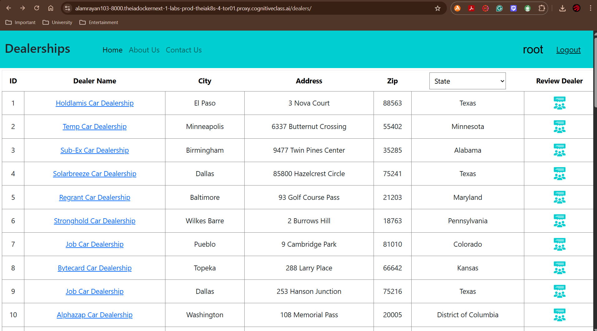

# 🚗 Dealership Review Portal

A full-stack web application that allows users to browse, review, and manage dealership branches across the United States. Built using Django, React, Node.js, MongoDB, and deployed with Docker, Kubernetes, and IBM Cloud Code Engine.


---

## 🌐 Live UI Preview

Below is a preview of the deployed **Dealerships** page showing the layout, dealer list, and review button functionality for each dealership:



---

## 🧩 Table of Contents

- [📌 Project Overview](#-project-overview)
- [🎯 Features](#-features)
- [🔧 Tech Stack](#-tech-stack)
- [🚀 Setup & Deployment](#-setup--deployment)

---

## 📌 Project Overview

The Dealership Review Portal provides a centralized platform for customers to browse dealership branches, view and post reviews, and for admins to manage car data. This platform brings transparency and trust to the dealership experience.

---

## 🎯 Features

### 🔓 Anonymous Users
- View About Us and Contact Us pages
- Browse dealership listings
- Filter dealerships by state
- View dealership reviews

### ✅ Authorized Users
- Log in with Django auth system
- Post reviews with sentiment analysis
- Submitted reviews appear at the top, sorted by timestamp

### 🛠️ Admin Users
- Log in to Django admin panel
- Manage car makes, models, and metadata

---

## 🔧 Tech Stack

| Layer                     | Technology                           |
|--------------------------|--------------------------------------|
| Frontend (User)          | React + Bootstrap                    |
| Backend (App)            | Django + SQLite                      |
| Backend (Dealers/Reviews)| Node.js (Express) + MongoDB          |
| NLP                      | IBM Watson (Code Engine)             |
| Deployment               | Docker, Kubernetes, IBM Cloud        |
| Authentication           | Django User Auth                     |

---

## 🚀 Setup & Deployment

This section provides a step-by-step guide to run and deploy the **Dealership Review Portal** project using your current structure.

### 🔧 Prerequisites

- Python 3.8+
- Docker & Docker Compose
- Node.js (if using React frontend in `frontend/`)
- Virtualenv
- kubectl (for Kubernetes deployment)
- IBM Cloud CLI (for sentiment analyzer deployment)
- Git

### 1️⃣ Clone the Repository

```bash
git clone https://github.com/Rayan-Alam-UOIT/Dealership-Review-Portal.git
cd Dealership-Review-Portal
```

### 2️⃣ Set Up Django Backend

```bash
### Create and activate virtual environment:
cd server
python -m venv venv
source venv/bin/activate  # Windows: venv\Scripts\activate

### Install Python dependencies:
pip install -r requirements.txt

### Run initial migrations:
python manage.py migrate

### Create superuser for admin access:
python manage.py createsuperuser

### Run the development server:
python manage.py runserver
```

App will be accessible at: http://127.0.0.1:8000

### 3️⃣ Run the Application with Docker (Optional)

```bash
### Make sure you are inside the server/ directory.
docker build -t dealership-review-portal .
docker run -p 8000:8000 dealership-review-portal

### If using entrypoint.sh, ensure it's executable:
chmod +x entrypoint.sh
```

### 4️⃣ Deploy with Kubernetes

```bash
### From the root or /server folder (where deployment.yaml is located):
kubectl apply -f deployment.yaml

### Verify that pods and services are running:
kubectl get all
```

Use kubectl port-forward or configure an Ingress to access the Django app.

### 5️⃣ Deploy Sentiment Analyzer on IBM Cloud Code Engine

1. Log in to IBM Cloud:

   `ibmcloud login`

2. Target the correct region:

   `ibmcloud target -r us-south`

3. Create the project and app:

   `ibmcloud code-engine project create --name sentiment-project
    ibmcloud code-engine app create --name sentiment-api \
      --image us.icr.io/your_namespace/sentiment-api:latest \
      --port 5000`

4. Update Django settings or `.env` file with the service URL returned.

### 6️⃣ React Frontend (Optional if present in /server/frontend)

```bash
### If you have a React frontend in server/frontend:
cd server/frontend
npm install
npm start

```


